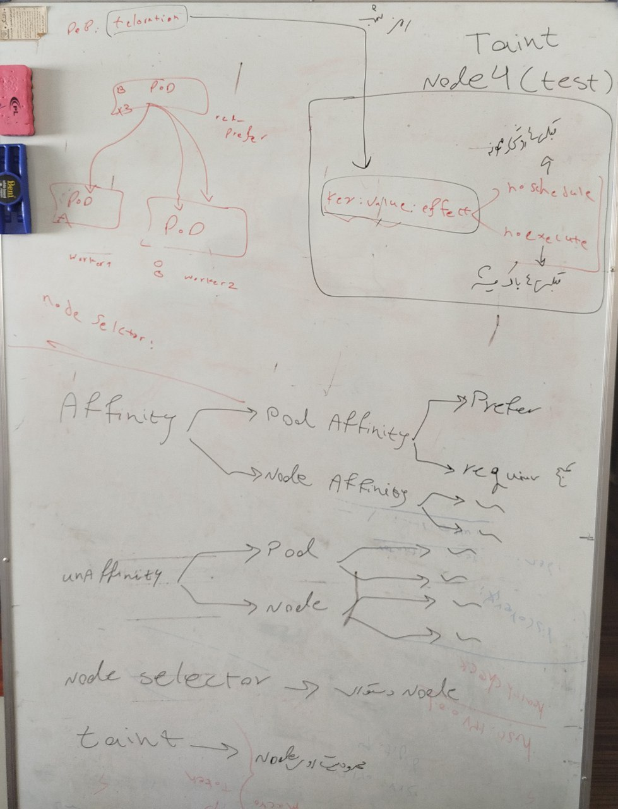

## Affinity (وابستگی):
مشخص می‌کند که یک پاد باید نزدیک به یک پاد یا نود خاص قرار گیرد.

به نوعی بیانگر تمایل به قرارگیری است.

برای مثال:

پادها باهم در یک نود قرار بگیرند (Pod Affinity).

پاد روی نود خاصی مستقر شود (Node Affinity).

## Anti-Affinity (ضد وابستگی):
مشخص می‌کند که یک پاد نباید نزدیک به یک پاد یا نود خاص قرار گیرد.

بیانگر تمایل به جدایی است.

برای مثال:

پادها در نودهای مختلف قرار بگیرند (Pod Anti-Affinity).

پاد از یک نود خاص دور باشد.

## nodeSelector

برای استفاده از NodeSelector، باید نودها را با Labels خاصی برچسب‌گذاری کنید. سپس در تعریف پاد، از NodeSelector استفاده می‌کنید تا تعیین کنید پاد فقط روی نودهایی با آن برچسب‌ها مستقر شود.

اگر در تعریف پاد از nodeSelector استفاده کنید و هیچ نودی با برچسب (key=value) مشخص‌شده مطابقت نداشته باشد، پاد زمان‌بندی نمی‌شود (unscheduled).

به عبارت دیگر، پاد در حالت Pending باقی می‌ماند و تا زمانی که نودی با برچسب صحیح پیدا شود یا YAML فایل اصلاح شود، اجرا نخواهد شد.

